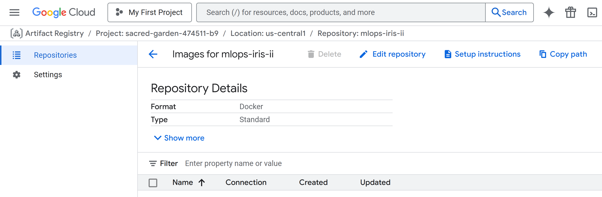
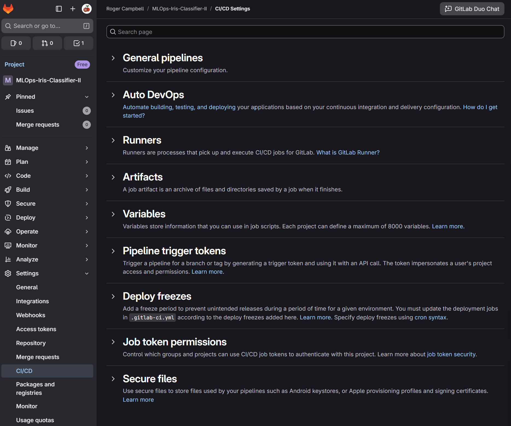
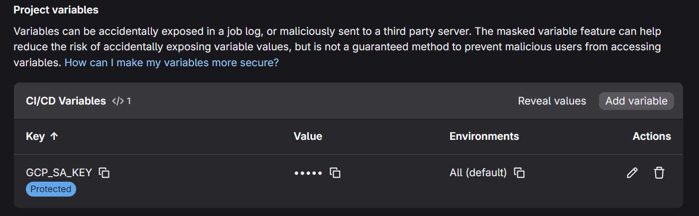
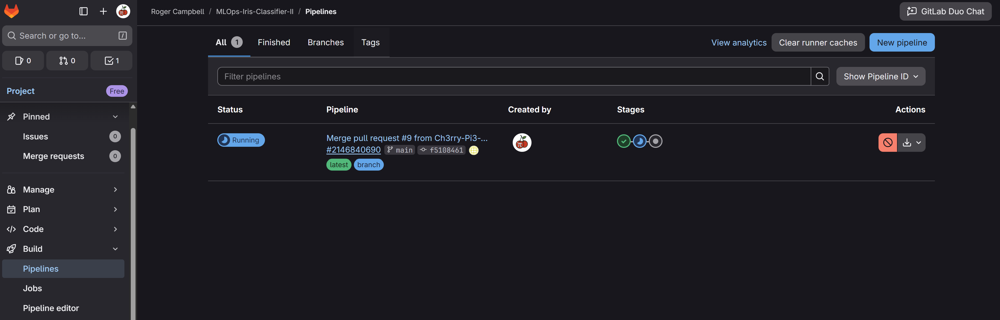
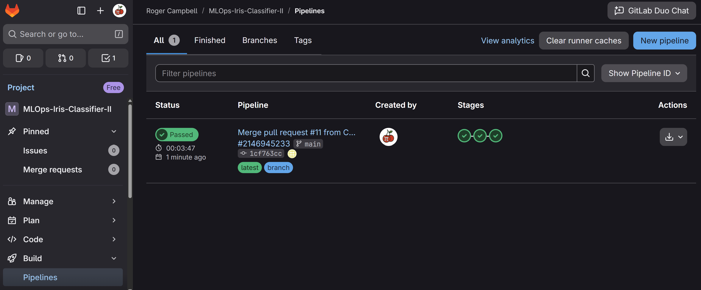
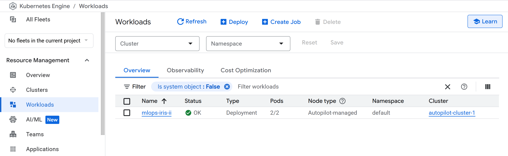
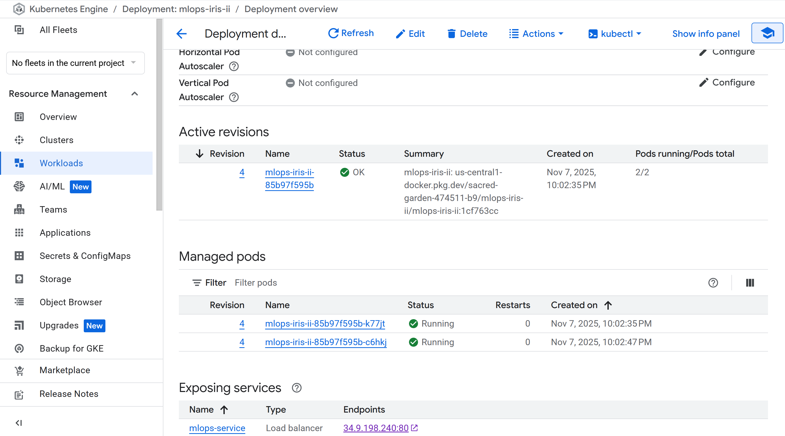

# 🚀 **CI/CD Pipeline — MLOps Iris Classifier**

This stage introduces **Continuous Integration and Continuous Deployment (CI/CD)** for the **MLOps Iris Classifier** using **GitLab Pipelines** and **Google Cloud Platform (GCP)**.
It automates the build, containerisation, and deployment of your Flask application into **Google Kubernetes Engine (GKE)**, enabling you to push updates directly from GitLab to production with minimal manual effort.

## 🧩 **Overview**

In this part of the project, you will:

1. Configure authentication with Google Cloud using a service account key.
2. Add the required files for containerisation and deployment (`Dockerfile`, `kubernetes-deployment.yaml`, `.gitlab-ci.yml`).
3. Encode your service account key into base64 for use in GitLab CI/CD variables.
4. Push to GitLab to trigger an automated build → push → deploy pipeline.
5. Access your running Flask application via the public endpoint in GKE.

## 1️⃣ Copy and Rename Your Service Account Key

Locate the **JSON key** you previously downloaded from GCP (in your **Downloads** folder).
Copy it into your project’s **root directory** and rename it:

```bash
mv ~/Downloads/<your-key>.json gcp-key.json
```

This file will be used by your CI/CD pipeline to authenticate with Google Cloud services.

## 2️⃣ Add the Dockerfile and Kubernetes Manifest

Copy the **`Dockerfile`** and **`kubernetes-deployment.yaml`** files from the reference repository into your project root.
You will also find the `.gitlab-ci.yml` in the same location.

In the **Kubernetes YAML file**, locate **line 26** (the image path).
Go to your **Artifact Registry** in GCP, click your repository, and select **“Copy path”** on the right-hand side.

<p align="center">
  
</p>

Now paste this path into line 26 of the YAML file, then append `/<Your Image Name>:latest`.
For example:

```
us-central1-docker.pkg.dev/sacred-garden-474511-b9/mlops-iris-ii/mlops-iris-ii:latest
```

This ensures your Kubernetes deployment pulls the correct container image from GCP.

## 3️⃣ Convert the GCP Key to Base64

Next, convert your JSON key to base64 format.
Open a terminal in your project root and run:

```bash
cat gcp-key.json | base64 -w 0
```

This command outputs your **base64-encoded key** as a single string.
It should look something like:

```
ewogICJ0eXB...29tIgp9Cg==
```

Copy the entire output — you’ll use it when configuring your GitLab variable.

## 4️⃣ Add the Base64 Key to GitLab CI/CD Variables

Log in to **GitLab**, open your project, and from the left-hand menu select **Settings → CI/CD**.

<p align="center">
  
</p>

Scroll down to the **Variables** section and click **“Add variable.”**

<p align="center">
  
</p>

In the **Key** field, enter `GCP_SA_KEY`.
In the **Value** field, paste the base64-encoded key you generated earlier.
Set **Visibility** to *Visible*, then click **Add variable**.

<p align="center">
  
</p>

This securely stores your credentials, allowing GitLab CI/CD to authenticate with GCP during pipeline execution.

## 5️⃣ Add the `.gitlab-ci.yml` File

In your project root, create a file called `.gitlab-ci.yml` and paste the CI/CD pipeline configuration.
This file defines three stages — **checkout**, **build**, and **deploy** — and automates the entire workflow from code to production.

Once you’ve added it, commit and push your code to GitLab:

```bash
git add .
git commit -m "Add CI/CD pipeline configuration"
git push gitlab main
```

This triggers your first CI/CD pipeline.

<p align="center">
  
</p>

After a few minutes, if all stages complete successfully, you will see:

<p align="center">
  
</p>

## 6️⃣ Verify the Deployment in GCP

Return to the **Google Cloud Console**.
Navigate to **Kubernetes Engine → Workloads**.

<p align="center">
  
</p>

Click on **mlops-iris-ii** and scroll down to the **Exposing services** section.

<p align="center">
  
</p>

The **Endpoint** link is your live project endpoint.
Click it to open the deployed **MLOps Iris Classifier** web application in your browser.

<p align="center">
  
</p>

You can now interact with the classifier directly from your deployed GCP environment — entering input values and receiving predictions in real time.

## 🗂️ **Updated Project Structure**

```text
mlops_iris_classifier/
├── .venv/                          # 🧩 Local virtual environment (created by uv)
├── artifacts/
│   ├── raw/
│   │   └── data.csv                # 🌸 Input Iris dataset
│   ├── processed/                  # 💾 Preprocessed artefacts (from DataProcessing)
│   │   ├── X_train.pkl
│   │   ├── X_test.pkl
│   │   ├── y_train.pkl
│   │   └── y_test.pkl
│   └── models/                     # 🧠 Trained model and evaluation artefacts
│       ├── model.pkl
│       └── confusion_matrix.png
├── img/
│   ├── cicd/
│   └── flask/
├── mlops_iris_classifier.egg-info/ # 📦 Package metadata (auto-generated)
├── pipeline/                       # ⚙️ Workflow orchestration layer
│   └── training_pipeline.py        # Executes data preparation + model training
├── src/
│   ├── __init__.py
│   ├── custom_exception.py         # Unified and detailed exception handling
│   ├── logger.py                   # Centralised logging configuration
│   ├── data_processing.py          # 🌱 Data preparation workflow
│   └── model_training.py           # 🌳 Model training and evaluation workflow
├── static/                         # 🎨 Visual assets (used in Flask UI)
├── templates/                      # 🧩 Flask HTML templates (for app stage)
├── .gitignore                      # 🚫 Git ignore rules
├── .python-version                 # 🐍 Python version pin
├── pyproject.toml                  # ⚙️ Project metadata and uv configuration
├── requirements.txt                # 📦 Python dependencies
├── setup.py                        # 🔧 Editable install support
├── uv.lock                         # 🔒 Locked dependency versions
├── Dockerfile                      # 🐳 Container image definition
├── kubernetes-deployment.yaml      # ☸️ Deployment & Service configuration
└── .gitlab-ci.yml                  # 🚀 CI/CD pipeline configuration for GitLab
```

## ✅ **In Summary**

This stage transforms the **MLOps Iris Classifier** into a fully automated, production-ready system.
Every code push triggers a pipeline that builds the Docker image, pushes it to **GCP Artifact Registry**, updates the **Kubernetes cluster**, and deploys the live application automatically.

By combining **GitLab CI/CD** with **Google Cloud Platform**, you now have a complete end-to-end MLOps workflow — from data ingestion and model training to deployment and live inference.
