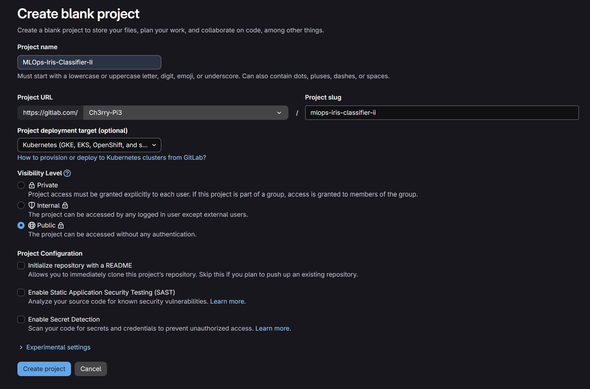
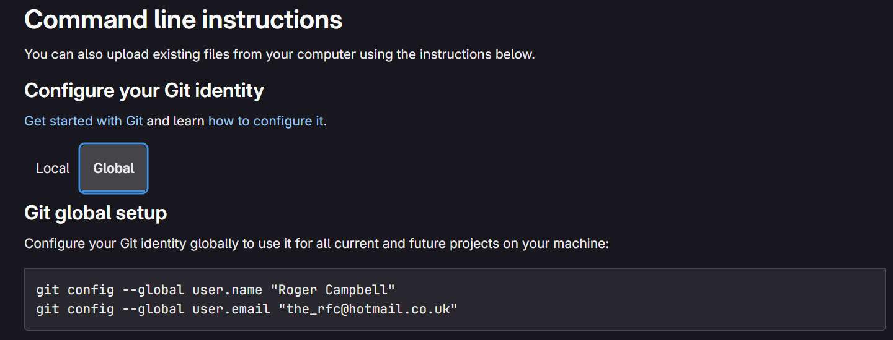
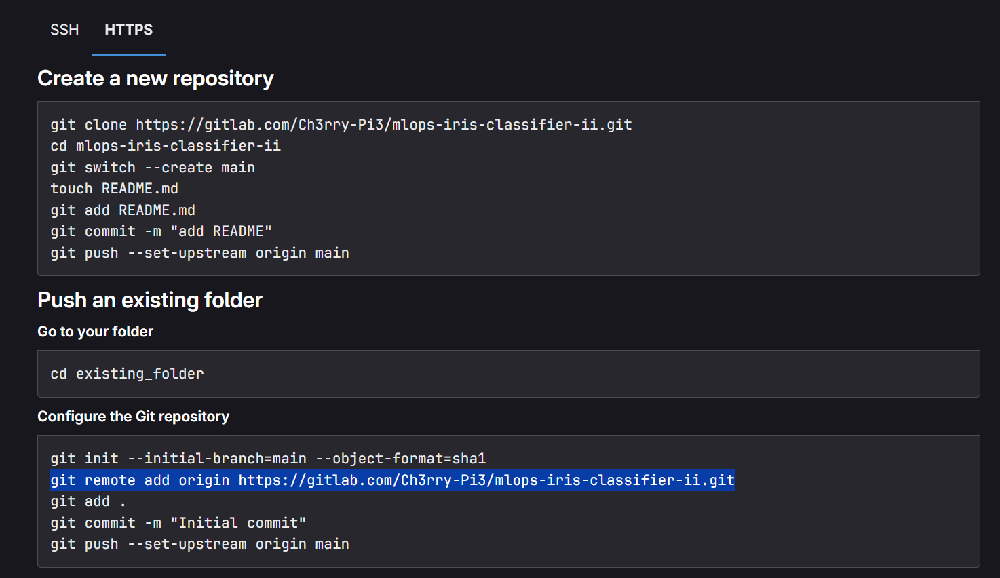

# 🦊 **GitLab Integration — MLOps Iris Classifier**

This stage introduces **GitLab integration** for the **MLOps Iris Classifier** project, allowing the repository to be mirrored and maintained across **both GitHub and GitLab**.
While GitHub remains excellent for open collaboration and ecosystem integration, GitLab offers additional advantages for **CI/CD automation**, **repository management**, and **self-hosted DevOps flexibility**.

Using both platforms in parallel provides redundancy and freedom — combining GitHub’s developer community with GitLab’s advanced pipeline control.

## 💡 Why Use GitLab (in Addition to GitHub)

| Feature                    | GitHub                                                        | GitLab                                                            |
| :------------------------- | :------------------------------------------------------------ | :---------------------------------------------------------------- |
| **CI/CD Integration**      | Requires external setup (e.g., GitHub Actions YAML workflows) | Built-in GitLab CI/CD with integrated runners                     |
| **Repository Visibility**  | Excellent for public, open-source collaboration               | Great for private or enterprise projects                          |
| **Permissions & Security** | Simple but limited for complex org setups                     | Fine-grained roles and access control                             |
| **DevOps Scope**           | Primarily source control & Actions                            | Complete DevOps lifecycle (Plan → Code → Test → Deploy → Monitor) |
| **Self-Hosting Option**    | Available only via GitHub Enterprise                          | Fully supported via GitLab Community/Enterprise editions          |

By linking this project to GitLab as well, future branches can easily integrate **GitLab pipelines**, **container registry support**, and **deployment automation** alongside GitHub’s existing workflow.

## 🧩 Step-by-Step GitLab Setup

### 1️⃣ Create or Log In to GitLab

Go to [https://gitlab.com](https://gitlab.com) and **sign up or log in**.

<p align="center">
  
</p>

### 2️⃣ Create a New Project

On the dashboard, click **“New Project”** and choose **Global** setup rather than **Local**.

<p align="center">
  
</p>

### 3️⃣ Configure Global Git Identity

In your project root terminal, configure your global Git identity (if not already done):

```bash
git config --global user.name "Roger Campbell"
git config --global user.email "the_rfc@hotmail.co.uk"
```

### 4️⃣ Copy the Git Remote Command

On the “Push an existing folder” screen, locate the section titled **Configure the Git repository**.
Copy the `git remote add origin …` command provided there.

<p align="center">
  
</p>

### 5️⃣ Add GitLab Remote (Alongside GitHub)

If this project is already connected to GitHub, simply give the new remote a different name:

```bash
git remote add gitlab https://gitlab.com/Ch3rry-Pi3/mlops-iris-classifier-ii.git
```

This means:

* `origin` → GitHub
* `gitlab` → GitLab

### 6️⃣ Pushing to GitLab

To push your latest branch (for example, `main` or `05_cicd`) to GitLab:

```bash
git push gitlab main
```

All regular commands like `git add .` and `git commit -m "message"` will work as usual — you only specify the target remote when pushing.

## ✅ In Summary

By integrating GitLab:

* You maintain a **redundant repository** for added resilience.
* You gain access to **built-in CI/CD pipelines** and **registry management**.
* You retain the **GitHub link** for open collaboration and visibility.
* The project remains **fully synchronised** across both platforms with minimal extra effort.

This dual-remote setup establishes a robust foundation for future **GitLab CI/CD automation**, complementing the existing **CircleCI integration** and extending the project’s overall DevOps capability.
